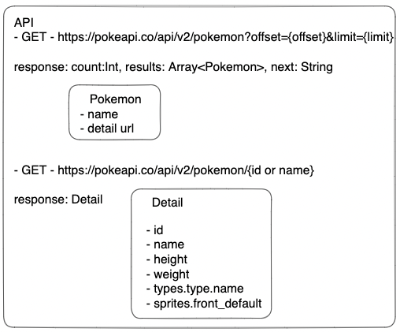
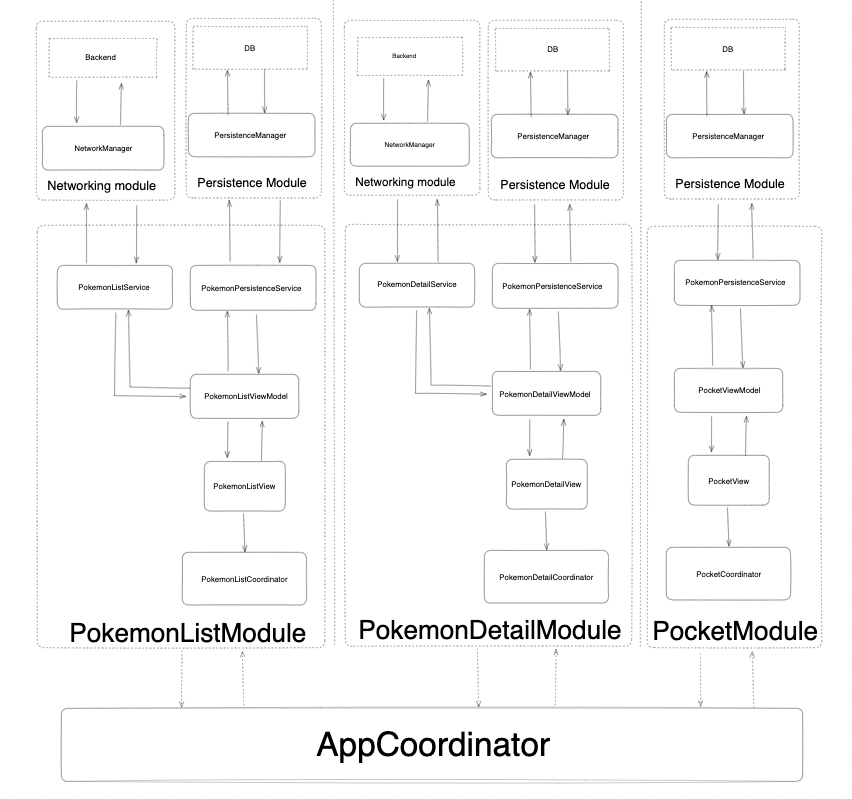
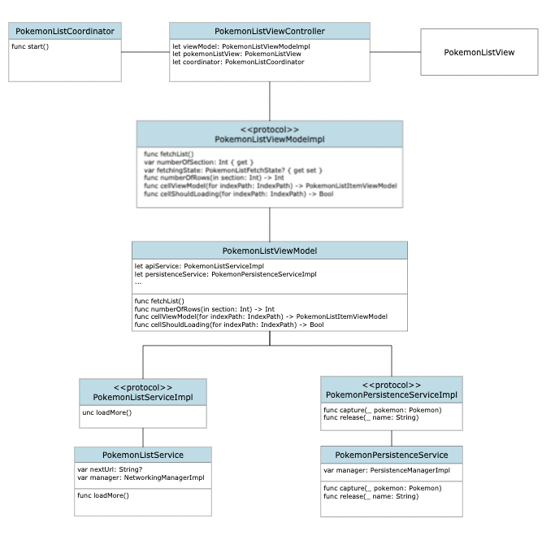

# My Pokemon

<table>
    <tr>
      <td>
        Pokemon list(infinite scroll) <br>
        
      </td>
      <td>
        Add or delete Favorite<br>
        
      </td>
      <td>
        Pokemon detail <br>
        
      </td>
    </tr>
</table>

# Set up

## Clone

```sh
git clone git@github.com:hanlinchentw/MyPokemon.git
```

## Install dependencies

```sh
pod install
```

```sh
open MyPokemon.xcworkspace
```

## Run

Press keyboard `cmd` + `R`

# Requirements

Functional

- User can view a list of Pokemon by scrolling.
- User can go to detail page by Clicking on an item.
- You should be able to add/remove it from your favorites.

Non-functional

- Infinite scroll: The homepage should be able to continuously load more Pokemon as the user scrolls down.
- Local storage: My favorites should be preserved even after the app is closed and reopened.

# API



# Tech Applied

<table>
  <tr>
    <td>Architecture</td>
    <td>MVVM+Coodinator</td>
  </tr>
  <tr>
    <td>Network</td>
    <td>Native Swift</td>
  </tr>
  <tr>
    <td>Local storage</td>
    <td><a href="https://github.com/realm/realm-swift">Realm</a></td>
  </tr>
  <tr>
    <td>Others</td>
    <td><a href="https://github.com/onevcat/Kingfisher">Kingfisher (Image Loader)</a></td>
  </tr>
</table>

# High level diagram



## Class diagram(Pokemon List module)

Here is only the class diagram for displaying the Pokemon list, as the others are more or less the same.


# Unit test spec
<table>
    <tr>
      <td>
        NetworkEndpointTestsSpec
      </td>
      <td>
        test_with_pokemon_endpoint_request_is_valid
        test_with_pokemon_endpoint_with20offset_request_is_valid
      </td>
    </tr>
    <tr>
      <td>
        NetworkingManagerTestSpec
      </td>
      <td>
        test_with_success_response_is_valid
        test_with_failed_response_status_code_is_invalid
        test_with_successful_response_with_wrong_decodable_type_is_invalid
      </td>
    </tr>
    <tr>
      <td>
        PokemonPersistenceServiceTestsSpec
      </td>
      <td>
        test_with_three_capture_count_be_3
        test_with_two_capture_one_release_count_be_2
        test_with_release_not_exist_pokemon_throw_error
      </td>
    </tr>
    <tr>
      <td>
        PokemonListServiceSuccessTestsSpec
      </td>
      <td>
        test_with_successful_response_and_update_results
      </td>
    </tr>
     <tr>
      <td>
        PokemonListServiceFailureTestsSpec
      </td>
      <td>
        test_with_failed_response_and_error_should_be_not_nil
      </td>
    </tr>
    <tr>
      <td>
        PokemonDetailServiceSuccessTestsSpec
      </td>
      <td>
        test_with_successful_response_and_update_result
      </td>
    </tr>
    <tr>
      <td>
        PokemonDetailServiceFailureTestsSpec
      </td>
      <td>
        test_with_failed_response_and_error_should_not_be_nil
      </td>
    </tr>
        <tr>
      <td>
        PokemonListViewModelSuccessTestsSpec
      </td>
      <td>
        test_with_successful_response_and_update_results_result_should_be_20
        test_with_successful_response_and_update_results_twice_result_should_be_40
        test_with_successful_response_and_capture_top_3
        test_with_successful_response_capture_and_release_one
      </td>
    </tr>
</table>
